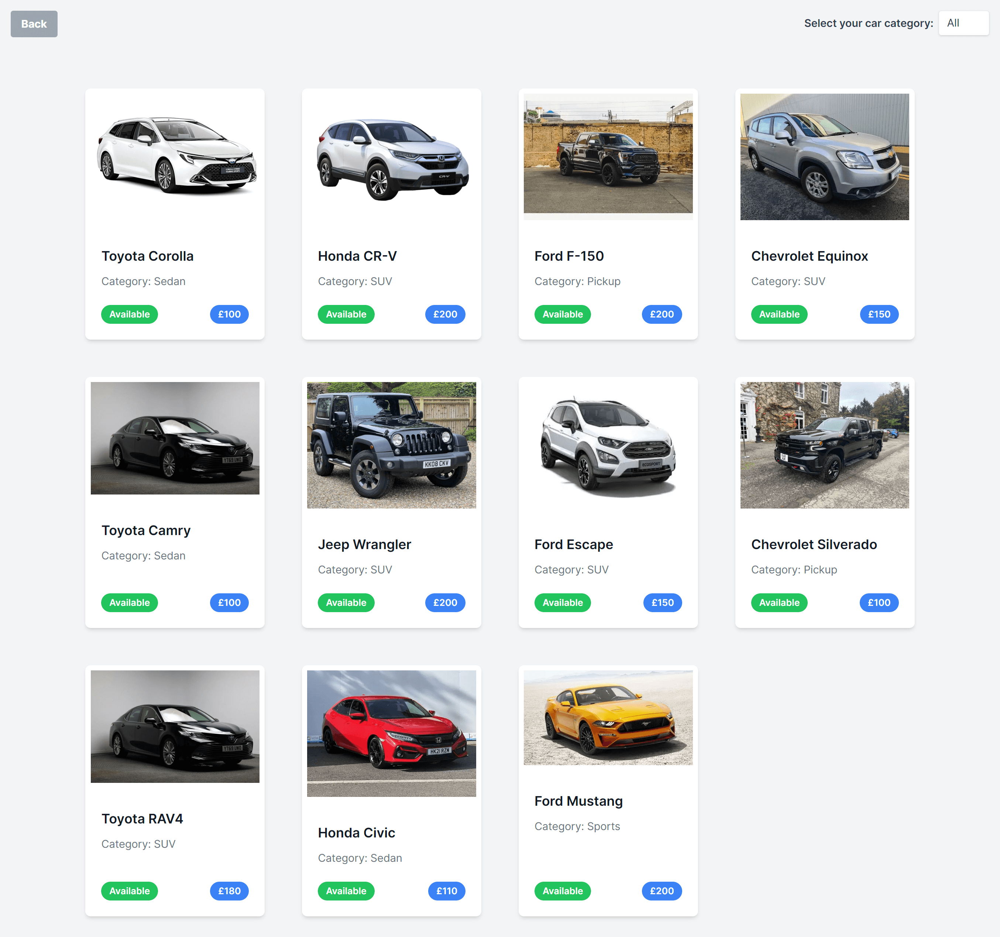

<div  align="center">


</div>


<h1  align="center">

🖥 Car Hire Booking System - Next.js v14 📱

</h1>


## 🗃 Project

This project is a web application built with TypeScript, React, and json-server. It's designed to provide a robust and scalable solution for modern web development needs.

The application leverages TypeScript for static typing, which enhances code quality and understandability. React, a popular JavaScript library, is used for building the user interface in a declarative style, making the code more predictable and easier to debug.

The backend is powered by json-server, a simple tool that lets you set up a full fake REST API for development and prototyping.

The combination of these technologies provides a solid foundation for building complex web applications, and offers a great starting point for projects that require a quick setup with robust features.

</br>


## 🛠 Technologies

This project was developed with the following technologies:

   **JavaScript**

   **TypeScript**

   **React**

   **Next.js**

   **React**

   **TailwindCSS**


</br>


## 💻 Demonstration


<h5 align="center"> 🔗 Online: https://nextjs14-car-hire.vercel.app</h5>

</br>
<p  align="center">
  <h5 align="center">🖥 Desktop:</h5>
  <kbd>

</kbd>
  <kbd>

</kbd>
</p>

</kbd>
</p>
  <h5 align="center">📱 Mobile:</h5>
<p  align="center">
<kbd>

</kbd>
<kbd>

</kbd>

</kbd>
</p>

</br>

## 🚀 How to run

If you want to run the project on your local machine, just follow the steps below:

```bash
$ git clone https://github.com/gmartins-dev/nextjs14-car-hire

# Install the dependencies

$ yarn install or npm install or pnpm install (recommended)

# Run FE

$ yarn run dev or npm run dev or pnpm run dev (recommended)

# Run BE (mock json-server)

$ yarn run json-server or npm run json-server or pnpm run json-server (recommended)

```
## 🛠 Possible improvements and new features:


1. Set a design system and better styling

2. Add dark/light themes

3. Forms:

  3.1 define what fields are required or optional

  3.2 use masks and validations

  3.3 use a third library like:  Formik or React Hook Forms

4. Create a modal: when click in a car card shows the car details modal

5. Add more filtering options and a search bar

6. Organize the TS interfaces and types in a separate folder/files

7. Implement tests:

  7.1 unit tests

  7.2 integration tests

  7.3 end-to-end test


</br>

## 📝 License


This project is licensed under the MIT license.


</p>


</br>
<hr/>
</br>


<h3> Guilherme Martins - @gmartins-dev </h3>

- Portfolio: https://gmartins.dev

- LinkedIn: https://www.linkedin.com/in/gmartins-dev

- GitHub: https://github.com/gmartins-dev

- Email: contact@gmartins.dev
